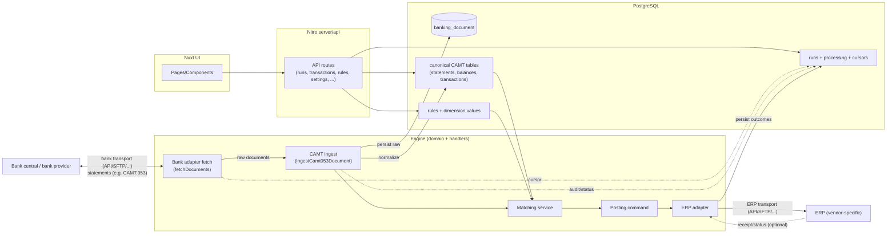

# Architecture

This repo is a stateless financial integration engine:
- All *state* lives in Postgres.
- Runtime behavior is deterministic from persisted state + inputs.
- Bank ingestion stores raw source documents for auditability and reproducibility.

## Core flow

1) Fetch raw bank documents (transport/adapters)
2) Persist document + normalize into canonical CAMT tables
3) Match transactions against deterministic rules
4) Generate ERP posting payloads and execute ERP integration

## Key concepts (domain)

- `banking_document`: raw source content (e.g. CAMT.053 XML) + hash (idempotency)
- `banking_statement`: statement header/account info extracted from document
- `banking_statement_balance`: statement balances (OPBD/CLBD/CLAV, etc.)
- `transaction`: normalized entry/tx details (Refs, Parties, BkTxCd, remittance)
- `rule` + `rule_banking_condition`: deterministic matching rules (CAMT-keyed)
- `erp_accounting_dimension_definition`: supplier-scoped definition of accounting dimensions (domain key, required/optional, ordering)
- `rule_accounting_dimension_value`: per-rule values for accounting dimensions (normalized; no hardcoded primary/secondary/tertiary)
- `transaction_processing`: processing status / rule-applied locking
- `banking_adapter_cursor`: opaque cursor per (account, adapter) for incremental fetching
- `run`: batch execution unit (audit/logging)

### Accounting dimensions (ERP)

Accounting dimensions are configured in the database. The engine/UI treat dimensions as domain keys (e.g. `artskonto`, `omkostningssted`, `psp-element`) and persist values per rule.

ERP adapters may need to map these domain keys into ERP-specific fields (e.g. GL account, cost center, WBS). That mapping is also data-driven via `erpTarget` on `erp_accounting_dimension_definition`, so adapters do not hardcode which domain key corresponds to which ERP field.

## System diagram



Communication with external bank systems and ERP systems is intentionally shown in generic terms.
Concrete protocols and delivery mechanisms (e.g. REST APIs, file exchange, SFTP, vendor SDKs) are an adapter concern and may vary by provider.
The domain flow (ingest → match → post) stays deterministic and vendor-agnostic regardless of transport.

## Notes on complexity

If you feel the system is getting "too many things":
- Keep adapters dumb: transport + auth + returning raw documents.
- Keep ingestion deterministic and central: document hash + canonical tables.
- Keep matching/posting free of vendor logic: only use canonical CAMT columns.
- Keep ERP accounting dimensions data-driven: definitions + ERP-target mapping live in the database, not in code or `.env`.

## Deployment considerations (production)

The app can run in multiple operational “roles” using the same container image:

- **web** (UI/API): safe to scale horizontally
- **scheduler** (scheduled tasks / cron): should typically be a single replica to avoid duplicate scheduling
- **worker** (queue/outbox processing): can be scaled independently of web

To keep deployments simple and reproducible, scheduling and DB setup are controlled via explicit env toggles:

- `APP_ROLE`: selects the operational role (`web`, `scheduler`, `worker`).
- `ENABLE_SCHEDULED_TASKS`: gates execution of scheduled tasks at runtime.
- `DB_MIGRATE_ON_START` and `DB_SEED_SYSTEM_ON_START`: control whether the container entrypoint runs migrations and system seeding.

### Runtime toggles (what they do)

- `ENABLE_SCHEDULED_TASKS`:
  - `"1"`: scheduled tasks are allowed to do work
  - anything else: scheduled tasks return `skipped` (no background work)
- `DB_MIGRATE_ON_START`:
  - `"1"`: run `pnpm db:migrate` on container start
  - anything else: skip migrations
- `DB_SEED_SYSTEM_ON_START`:
  - `"1"`: run `pnpm db:seed:system` on container start
  - anything else: skip system seed

Recommended practice is to run migrations/seeding as a separate, explicit “run once” step per release (rather than at every pod start) to avoid race conditions in multi-replica setups.

## Runbook (production)

This section is written for operators and deployment vendors.

### Assumed tenancy model

- 1 Kubernetes namespace per customer
- 1 Postgres database per namespace/customer
- 1 OIDC/openid proxy per namespace/customer

### Roles

The same container image is deployed in different roles via `APP_ROLE`.

- `APP_ROLE=web`
  - Purpose: UI + HTTP API
  - Replicas: 2+ (scale horizontally)
  - Background work: none (must not run scheduled work)
- `APP_ROLE=scheduler`
  - Purpose: scheduled tasks / cron
  - Replicas: 1 (avoid duplicate scheduling)
  - Behavior: **enqueue-only** (it schedules jobs; it does not process the queue)
  - Note: scheduled ingestion creates a `run` row up front and enqueues a `banking.ingest` job with `job.runId` set, so troubleshooting/recovery can be done per run.
- `APP_ROLE=worker`
  - Purpose: queue + outbox processing
  - Replicas: 1+ (scale independently based on throughput)
  - Behavior: runs continuously in a worker loop

#### Worker profiles (I/O vs CPU)

Why split?

- **I/O work** (network/SFTP/HTTP) tends to be slow, spiky, and retry-heavy.
- **CPU/DB work** (parsing, normalizing, rule evaluation) is usually faster per item but benefits from predictable throughput.

If you run both in the same worker loop, a slow SFTP/HTTP call can reduce overall throughput and make troubleshooting harder (“is the system slow because the queue is big, or because the network is slow?”).

First iteration (no schema changes): workers can be started with a profile using `WORKER_PROFILE`:

- `WORKER_PROFILE=all` (default): process both jobs and outbox
- `WORKER_PROFILE=cpu`: process CPU-heavy jobs only (e.g. `banking.ingest`), no outbox
- `WORKER_PROFILE=io`: process I/O-heavy work (outbox + `erp.ingestResponses`)

Optional tuning (applies to all profiles):

- `WORKER_MAX_JOBS`: max jobs processed per loop iteration (default: profile-dependent)
- `WORKER_MAX_OUTBOX`: max outbox items processed per loop iteration (default: profile-dependent)
- `WORKER_IDLE_SLEEP_MS`: sleep when no work was found (default 1000)
- `WORKER_ERROR_SLEEP_MS`: sleep after an iteration error (default 5000)

Profile defaults:

- `WORKER_PROFILE=all`: `WORKER_MAX_JOBS=25`, `WORKER_MAX_OUTBOX=100`
- `WORKER_PROFILE=cpu`: `WORKER_MAX_JOBS=25`, `WORKER_MAX_OUTBOX=0`
- `WORKER_PROFILE=io`: `WORKER_MAX_JOBS=10`, `WORKER_MAX_OUTBOX=100`

This enables two worker deployments:

- **cpu-worker**: stable throughput for ingest/matching work
- **io-worker**: isolates SFTP/HTTP delays and retries

### Required env (high level)

- `APP_ROLE`: `web` | `scheduler` | `worker`
- `DATABASE_URL`: Postgres connection string (scoped per namespace/customer)
- Integration secrets (scoped per namespace/customer): bank, SFTP, ERP, OIDC

### Recommended deployment flow (per release)

1) Run DB migrations + system seed once (Job/pipeline step)
2) Roll out `web` deployment
3) Roll out `scheduler` deployment
4) Roll out `worker` deployment

### Migrations and system seed

Recommended strategy:

- Run migrations + system seed **once per release** as a dedicated “run once” step.
- Do not run migrations automatically on every pod start in `web`/`scheduler`/`worker`.

Run-once step (interface):

- Run the application’s DB migration script: `db:migrate`
- Run the application’s system seed script: `db:seed:system` (idempotent; safe to run repeatedly)

How you trigger that step depends on the deployment vendor (Kubernetes Job, CI/CD step, Helm hook, etc.).
The production image is expected to contain the tooling needed to run these scripts.

Minimal env required for the run-once step:

- `DATABASE_URL`
- `ERP_SUPPLIER` (for system seed)

Emergency-only:

- `DB_MIGRATE_ON_START="1"` and `DB_SEED_SYSTEM_ON_START="1"` can be used to run these from the container entrypoint, but should not be the default in multi-replica setups.

Example invocation (optional):

- `pnpm db:migrate && pnpm db:seed:system`

### Duplicate-safety

Scheduled tasks that enqueue work should be safe against accidental multi-replica scheduler deployments.
For that reason, tasks may use Postgres advisory locks (e.g. `pg_try_advisory_lock`) so only one scheduler instance enqueues per schedule tick.

### Health

- Liveness/readiness can use `/api/health`.

### Multi-customer isolation model

The recommended operational model for multiple customers is:

- one Kubernetes namespace per customer
- one Postgres database per namespace/customer
- one OIDC/openid proxy per namespace/customer

This avoids cross-tenant data concerns inside the application and keeps the domain model simple: the app instance is effectively “single-tenant” because its `DATABASE_URL` (and other secrets) are scoped to the customer.

### Minimal Helm values examples (web vs scheduler)

Many operators run the same chart/image in two roles (two Helm releases or two deployments), differing only by env + replica count.

Example overrides:

**web** (safe to scale, no background work):

```yaml
openid:
  replicaCount: 2
  deployment:
    env:
      APP_ROLE:
        value: "web"
      ENABLE_SCHEDULED_TASKS:
        value: "0"
      DB_MIGRATE_ON_START:
        value: "0"
      DB_SEED_SYSTEM_ON_START:
        value: "0"
```

**scheduler** (single replica, enqueues work):

```yaml
openid:
  replicaCount: 1
  deployment:
    env:
      APP_ROLE:
        value: "scheduler"
      ENABLE_SCHEDULED_TASKS:
        value: "1"
      DB_MIGRATE_ON_START:
        value: "0"
      DB_SEED_SYSTEM_ON_START:
        value: "0"
```

**worker (cpu)**:

```yaml
openid:
  replicaCount: 1
  deployment:
    env:
      APP_ROLE:
        value: "worker"
      WORKER_PROFILE:
        value: "cpu"
```

**worker (io)**:

```yaml
openid:
  replicaCount: 1
  deployment:
    env:
      APP_ROLE:
        value: "worker"
      WORKER_PROFILE:
        value: "io"
```
