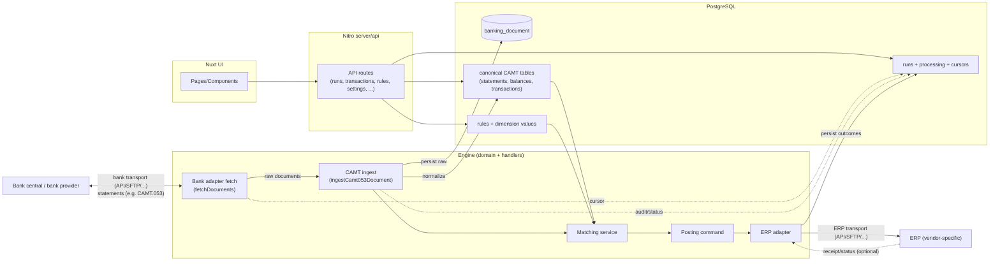

# Architecture

This repo is a stateless financial integration engine:
- All *state* lives in Postgres.
- Runtime behavior is deterministic from persisted state + inputs.
- Bank ingestion stores raw source documents for auditability and reproducibility.

## Core flow

1) Fetch raw bank documents (transport/adapters)
2) Persist document + normalize into canonical CAMT tables
3) Match transactions against deterministic rules
4) Generate ERP posting payloads and execute ERP integration
5) Send notifications (mail/SMS/etc.) via outbox (side-effect)

## Authentication and Authorization (v1)

- Authentication/session lifecycle is handled by `nuxt-oidc-auth`.
- UI visibility is role-gated in:
  - `app/composables/useAuthz.ts`
  - `app/layouts/default.vue`
  - role policies in `app/lib/authz/policy.ts`
- Server API authorization is enforced in route handlers via `server/auth/requireAppRoles.ts`.
- The first releasable version does not include the Keycloak Admin management API surface.

## Banking agreement activation and SOAP date scoping

- Enabling a banking agreement must not trigger transaction ingestion as a side effect.
- Ingestion is initiated explicitly via run endpoints/scheduled tasks.
- For ISO 20022 SOAP adapters, fetch requests are always scoped to a concrete booking date.
- The booking date is propagated end-to-end from run start to adapter fetch (`YYYY-MM-DD`) and used as an explicit day window.

## Bank adapters (transport)

Bank ingestion integrates via the narrow port `BankAdapter.fetchDocuments`.

Some bank providers use the “BXD Secure Envelope” (`ApplicationRequest`/`ApplicationResponse`) schema (namespace `http://bxd.fi/xmldata/`) combined with XML Digital Signatures.
Shared helpers live in:

- engine/banking-ingestion/infrastructure/bxd/secureEnvelope.ts
- engine/banking-ingestion/infrastructure/bxd/xmlDsig.ts

Provider-specific adapters then add protocol/security concerns on top (SOAP, mTLS, message-level encryption, etc.).
For Danske Bank Web Services, the published WSDL shows that EDIWS carries `ApplicationRequest`/`ApplicationResponse` as `base64Binary`, and examples indicate message-level encryption/signing.

Operational detail (PKIWS v2.9): PKIWS `RequestHeader.Environment` uses `customertest` for test-mode and `production` for production; and `RequestId` is limited to 10 characters.

Operational detail (EDIWS v5.0): EDIWS validates a SOAP-level XMLDSig signature and rejects SOAP packets older than ~5 minutes; and Danske Bank does not support HTTP `Transfer-Encoding: chunked`. Data sent to the bank is required to be encrypted at the ApplicationRequest level; error responses may be unencrypted.

Operational detail (Nordea CA Web Services): Nordea requires WS-Security `Timestamp` and a SOAP-level XMLDSig signature over the SOAP Body. For account statements we default to the Corporate Access file type `NDAREXXMLO` (CAMT.053 extended).

### Certificate enrollment (provider-agnostic)

Certificate enrollment is modeled as a provider-dispatch operation under `scripts/banking/pki/create-customer-certs.ts`.

- Shared entrypoint: `pnpm banking:pki:create-customer-certs -- --provider <vendor> ...`
- Provider implementations live under `scripts/banking/<vendor>/`.
- Runtime ingestion uses persisted key/certificate material; enrollment is an operational provisioning workflow, not part of the stateless matching/posting engine path.

Current providers:

- Danske Bank: PKIWS-based provisioning script.
- Nordea: CertificateService SOAP-based provisioning script (best effort from public docs/WSDL shape).

Security posture for enrollment workflows:

- Prefer secret input via files/env over plaintext CLI arguments.
- Keep generated key/cert artifacts in workspace-local secret paths (for example `.secrets/`) and out of git.
- Avoid printing secret material by default where provider implementation allows it.

For operational commands and provider-specific parameters, see `docs/CERTIFICATE_ENROLLMENT_RUNBOOK.md` (cross-vendor runbook).

### Selecting an adapter (runtime)

At runtime the batch ingestion handler selects a bank adapter **deterministically from persisted database state**:

- For each enabled provider (`banking_agreement.enabled=true`), we read `banking_agreement.channel`.
- `channel=iso20022` routes to the current ISO 20022 (camt.053) adapters.
- `channel=rest` is reserved for provider REST APIs (to be implemented per provider).

### Selecting an adapter (dev)

For development and smoke testing, an explicit env override can force a specific adapter regardless of database configuration:

- Set `BANK_ADAPTER=danskebank-edi-ws` to use Danske Bank EDIWS
- Set `BANK_ADAPTER=nordea-corporate-access-ws` to use Nordea Corporate Access Web Services
- Set `BANK_ADAPTER=local-file` to force the deterministic local CAMT.053 file adapter

Danske Bank EDIWS needs additional env (IDs + signing material). See:

- engine/banking-ingestion/infrastructure/danskebank/danskeBankEdiEnvConfig.ts
- engine/banking-ingestion/infrastructure/danskebank/danskeBankEnvSecrets.ts

### Agreements and account discovery

Bank Web Services are typically agreement-scoped (provider/customer credentials determine which files are accessible).
The system models this explicitly via `banking_agreement` (one per provider) and fetches documents per enabled provider.

Note: `banking_agreement.channel` allows each installation/tenant to choose whether a provider is contacted via ISO 20022 or a REST API.

For API-based channels (e.g. Nordea Premium API), the system may require an explicit, provider-level allowlist of which accounts are permitted to be fetched.
This is modeled as `banking_agreement_account_allowlist` and stores IBANs per provider.
The allowlist is **not** modeled per channel; it is provider-scoped configuration that the selected adapter may choose to enforce.

Bank accounts are not manually created by end users. Instead, accounts are discovered from ingested CAMT.053 statements and upserted deterministically using the statement's IBAN + currency (e.g. `DKxxxxxxxxxxxxxx-DKK`).

## Key concepts (domain)

- `banking_document`: raw source content (e.g. CAMT.053 XML) + hash (idempotency)
- `banking_statement`: statement header/account info extracted from document
- `banking_statement_balance`: statement balances (OPBD/CLBD/CLAV, etc.)
- `transaction`: normalized entry/tx details (Refs, Parties, BkTxCd, remittance)
- `transaction_code_catalog`: provider-scoped code/name catalog for human-readable BkTxCd/proprietary labels (deterministic lookup)
- `rule` + `rule_banking_condition`: deterministic matching rules (CAMT-keyed). Conditions include an explicit operator (e.g. `eq`, `ilike`, `regex`). Regex is only allowed for selected text/counterparty fields and is validated on input/import.
- `erp_accounting_dimension_definition`: supplier-scoped definition of accounting dimensions (domain key, required/optional, ordering)
- `erp_accounting_dimension_constraint` + `erp_accounting_dimension_constraint_member`: supplier-scoped dependency rules between dimensions (used for deterministic validation across UI/API/import). Constraints may be conditional on the triggering dimension value via regex (e.g. different rules for `artskonto` prefixes).
- `rule_accounting_dimension_value`: per-rule values for accounting dimensions (normalized; no hardcoded primary/secondary/tertiary)
- `transaction_processing`: processing status / rule-applied locking
- `manual_booking_draft` (+ lines/dimensions/attachments): user-edited draft state for open transactions (supports saving notes and multi-line manual postings without sending to ERP)
- `outbox`: durable, retry-safe side effects (ERP upload, notifications, ...)
- `notification_settings`: persisted notification template settings (UI-editable)
- `banking_agreement_cursor`: opaque cursor per (provider agreement, adapter) for incremental fetching
- `run`: batch execution unit (audit/logging)

## Database indexing strategy

The database remains the single source of truth, so read performance is achieved by explicit, deterministic indexes in Drizzle schema definitions.

- Indexes are added on foreign keys that are frequently joined (`run_id`, `transaction_id`, `statement_id`, etc.).
- API list endpoints use composite indexes that mirror filter+sort paths (for example account/date/id and run/status/date patterns).
- Worker claim loops use composite status+time indexes:
  - `job(status, run_at)` for pending job pickup
  - `outbox(status, next_attempt_at)` for retry-safe outbox pickup
- Diagnostics endpoints use run/status/time indexes (`error`, `job`, `outbox`) for fast incident views.

When schema/indexes change, migrations follow the baseline-only workflow used in this repository (regenerate a single `drizzle/0000_baseline.sql`).

## Notifications (SMTP)

Notifications are treated as a **side effect** and must be retry-safe and auditable.

- Matching produces notifications as pure data (`to`, `subject`, `body`).
- Sending is performed via `outbox` (`topic=notifications.mail`).
- The worker drains outbox items and performs SMTP IO, updating outbox status (`sent`/`failed`) with retries.

### SMTP constraints

- Sender address comes from env: `AUTH_SENDER_ADDRESS`.
- SMTP host comes from env: `SMTP_HOST` (legacy fallback: `SMTP_DOMAIN`).
- Allowed recipient domain comes from env: `SMTP_ALLOWED_RECIPIENT_DOMAIN` (legacy fallback: `SMTP_DOMAIN`).
- SMTP port comes from env: `SMTP_PORT` (default: 25).
- Rule-defined recipient addresses are validated to be within `SMTP_ALLOWED_RECIPIENT_DOMAIN`.

### Local SMTP testing (Mailpit)

For local development we use a local SMTP sink (Mailpit) to test email sending without delivering real email.

- `docker-compose.yml` includes a `mailpit` service:
  - SMTP: `mailpit:1025` (inside docker network)
  - Web UI: http://localhost:8025 (from your browser)

Recommended env values for local dev when running the app via docker compose:

- `SMTP_HOST=mailpit`
- `SMTP_PORT=1025`
- `SMTP_ALLOWED_RECIPIENT_DOMAIN=example.com`
- `AUTH_SENDER_ADDRESS=sender@example.com`

Manual smoke test from the repo (sends one email using the SMTP client):

- `pnpm smoke:smtp -- --to=test@example.com`

Open Mailpit UI (http://localhost:8025) to verify the message was captured.

### Template

The notification body is rendered from a stored template:

- Default template lives in code (deterministic fallback).
- The active template is persisted in Postgres (`notification_settings.mail_template`) and can be edited under Indstillinger → Notifikation.

## Logging

The system uses **structured JSON logs** written to **stdout/stderr** (container logs).

- The base logger is implemented in `app/lib/logger.ts` and is used by both `engine/` and `server/` code.
- Logging is **event + metadata** oriented. Avoid logging full domain objects, payloads, headers, cookies, or PII.
- The logger applies key-based redaction for common sensitive fields (tokens, cookies, CPR, IBAN, account numbers, etc.).

### Correlation

- HTTP requests are correlated using `x-request-id`.
- A global Nitro plugin assigns a request id when missing and logs API responses/errors.

### API logging (Nitro)

API request logging is handled globally (not per endpoint) to ensure consistent behavior across all routes.

- Default: log only 4xx/5xx and slow requests to reduce redundancy with upstream access logs.
- Optional: enable full access logs with `API_ACCESS_LOG=1`.
- Slow threshold can be tuned with `API_SLOW_MS` (default 1000ms).

### Accounting dimensions (ERP)

Accounting dimensions are configured in the database. The engine/UI treat dimensions as domain keys (e.g. `artskonto`, `omkostningssted`, `psp-element`) and persist values per rule.

ERP adapters may need to map these domain keys into ERP-specific fields (e.g. GL account, cost center, WBS). That mapping is also data-driven via `erpTarget` on `erp_accounting_dimension_definition`, so adapters do not hardcode which domain key corresponds to which ERP field.

#### Defaults vs runtime state

- Runtime validation always uses **database state** (`erp_accounting_dimension_definition` + constraints) to stay deterministic and auditable.
- Canonical **default** definitions/constraints shipped with the codebase live in `engine/erp-integration/domain/accountingDimensionDefaults.ts`.
- `pnpm db:seed:system` bootstraps those defaults into Postgres **idempotently** (it inserts missing rows and never wipes existing configuration).

#### Constraint semantics

Constraints are evaluated deterministically based on the *filled* dimension values.

- `requires_any_of`: if `ifKey` is filled, at least one member key must also be filled.
- `requires_all_of`: if `ifKey` is filled, all member keys must also be filled.
- `requires_exactly_one_of`: if `ifKey` is filled, exactly one member key must also be filled.
- `forbids_any_of`: if `ifKey` is filled, none of the member keys may be filled.

Constraints can be restricted to specific value patterns for the triggering dimension using an optional regex (e.g. “when `artskonto` starts with S or 9”).

## System diagram



Communication with external bank systems and ERP systems is intentionally shown in generic terms.
Concrete protocols and delivery mechanisms (e.g. REST APIs, file exchange, SFTP, vendor SDKs) are an adapter concern and may vary by provider.
The domain flow (ingest → match → post) stays deterministic and vendor-agnostic regardless of transport.

## Notes on complexity

If you feel the system is getting "too many things":
- Keep adapters dumb: transport + auth + returning raw documents.
- Keep ingestion deterministic and central: document hash + canonical tables.
- Keep matching/posting free of vendor logic: only use canonical CAMT columns.
- Keep ERP accounting dimensions data-driven: definitions + ERP-target mapping live in the database, not in code or `.env`.

## Deployment considerations (production)

The app can run in multiple operational “roles” using the same container image:

- **web** (UI/API): safe to scale horizontally
- **scheduler** (scheduled tasks / cron): should typically be a single replica to avoid duplicate scheduling
- **worker** (queue/outbox processing): can be scaled independently of web

To keep deployments simple and reproducible, scheduling and DB setup are controlled via explicit env toggles:

- `APP_ROLE`: selects the operational role (`web`, `scheduler`, `worker`).
- `ENABLE_SCHEDULED_TASKS`: legacy fallback (only used when `APP_ROLE` is unset) to allow role-gated tasks to do work.
- `DB_MIGRATE_ON_START` and `DB_SEED_SYSTEM_ON_START`: control whether the container entrypoint runs migrations and system seeding.

### Runtime toggles (what they do)

- `APP_ROLE`:
  - `web`: UI/API only (safe to scale; must not do background work)
  - `scheduler`: enqueue-only scheduled work
  - `worker`: continuously drains jobs/outbox
- `ENABLE_SCHEDULED_TASKS` (legacy fallback):
  - Only used when `APP_ROLE` is unset
  - `"1"`: role-gated tasks may do work
  - anything else: role-gated tasks return `skipped`
- `DB_MIGRATE_ON_START`:
  - `"1"`: run `pnpm db:migrate` on container start
  - anything else: skip migrations
- `DB_SEED_SYSTEM_ON_START`:
  - `"1"`: run `pnpm db:seed:system` on container start
  - anything else: skip system seed

Recommended practice is to run migrations/seeding as a separate, explicit “run once” step per rollout **per database** (rather than at every pod start). If you deploy multiple Helm releases (web/scheduler/worker) pointing at the same Postgres database, you still run migrations/seed once for that shared database.

## Runbook (production)

This section is written for operators and deployment vendors.

### Assumed tenancy model

- 1 Kubernetes namespace per customer
- 1 Postgres database per namespace/customer
- 1 OIDC/openid proxy per namespace/customer

### Roles

The same container image is deployed in different roles via `APP_ROLE`.

- `APP_ROLE=web`
  - Purpose: UI + HTTP API
  - Replicas: 2+ (scale horizontally)
  - Background work: none (must not run scheduled work)
- `APP_ROLE=scheduler`
  - Purpose: scheduled tasks / cron
  - Replicas: 1 (avoid duplicate scheduling)
  - Behavior: **enqueue-only** (it schedules jobs; it does not process the queue)
  - Note: scheduled ingestion creates a `run` row up front and enqueues a `banking.ingest` job with `job.runId` set, so troubleshooting/recovery can be done per run.
  - Scheduled tasks (Nitro `scheduledTasks`) currently include:
    - `bank-transactions-batch` (enqueues `banking.ingest`)
    - `db-cleanup-batch` (enqueues `ops.dbCleanup`)
- `APP_ROLE=worker`
  - Purpose: queue + outbox processing
  - Replicas: 1+ (scale independently based on throughput)
  - Behavior: runs continuously in a worker loop

#### Worker profiles (I/O vs CPU)

Why split?

- **I/O work** (network/SFTP/HTTP) tends to be slow, spiky, and retry-heavy.
- **CPU/DB work** (parsing, normalizing, rule evaluation) is usually faster per item but benefits from predictable throughput.

If you run both in the same worker loop, a slow SFTP/HTTP call can reduce overall throughput and make troubleshooting harder (“is the system slow because the queue is big, or because the network is slow?”).

First iteration (no schema changes): workers can be started with a profile using `WORKER_PROFILE`:

- `WORKER_PROFILE=all` (default): process both jobs and outbox
- `WORKER_PROFILE=cpu`: process CPU-heavy jobs only (e.g. `banking.ingest`), no outbox
- `WORKER_PROFILE=io`: process I/O-heavy work (outbox + `erp.ingestResponses`)

Data retention (sensitive/history cleanup):

- The worker job `ops.dbCleanup` deletes non-domain history/payload tables older than the configured retention period.
- Configure retention via env: `DATA_RETENTION_DAYS` (default: 90).

Optional tuning (applies to all profiles):

- `WORKER_MAX_JOBS`: max jobs processed per loop iteration (default: profile-dependent)
- `WORKER_MAX_OUTBOX`: max outbox items processed per loop iteration (default: profile-dependent)
- `WORKER_IDLE_SLEEP_MS`: sleep when no work was found (default 1000)
- `WORKER_ERROR_SLEEP_MS`: sleep after an iteration error (default 5000)

Profile defaults:

- `WORKER_PROFILE=all`: `WORKER_MAX_JOBS=25`, `WORKER_MAX_OUTBOX=100`
- `WORKER_PROFILE=cpu`: `WORKER_MAX_JOBS=25`, `WORKER_MAX_OUTBOX=0`
- `WORKER_PROFILE=io`: `WORKER_MAX_JOBS=10`, `WORKER_MAX_OUTBOX=100`

This enables two worker deployments:

- **cpu-worker**: stable throughput for ingest/matching work
- **io-worker**: isolates SFTP/HTTP delays and retries

### Required env (high level)

- `APP_ROLE`: `web` | `scheduler` | `worker`
- `DATABASE_URL`: Postgres connection string (scoped per namespace/customer)
- Integration secrets (scoped per namespace/customer): bank, SFTP, ERP, OIDC

### Recommended deployment flow (per rollout)

1) Run DB migrations + system seed once (Job/pipeline step)
2) Roll out `web` deployment
3) Roll out `scheduler` deployment
4) Roll out `worker` deployment

### Migrations and system seed

Recommended strategy:

- Run migrations + system seed **once per rollout per database** as a dedicated “run once” step.
- Do not run migrations automatically on every pod start in `web`/`scheduler`/`worker`.

Run-once step (interface):

- Run the application’s DB migration script: `db:migrate`
- Run the application’s system seed script: `db:seed:system` (idempotent; safe to run repeatedly)

How you trigger that step depends on the deployment vendor (Kubernetes Job, CI/CD step, Helm hook, etc.).
The production image is expected to contain the tooling needed to run these scripts.

Minimal env required for the run-once step:

- `DATABASE_URL`
- `ERP_SUPPLIER` (for system seed)

Emergency-only:

- `DB_MIGRATE_ON_START="1"` and `DB_SEED_SYSTEM_ON_START="1"` can be used to run these from the container entrypoint, but should not be the default in multi-replica setups.

Example invocation (optional):

- `pnpm db:migrate && pnpm db:seed:system`

### Duplicate-safety

Scheduled tasks that enqueue work should be safe against accidental multi-replica scheduler deployments.
For that reason, tasks may use Postgres advisory locks (e.g. `pg_try_advisory_lock`) so only one scheduler instance enqueues per schedule tick.

### Health

- Liveness/readiness can use `/api/health`.

### Multi-customer isolation model

The recommended operational model for multiple customers is:

- one Kubernetes namespace per customer
- one Postgres database per namespace/customer
- one OIDC/openid proxy per namespace/customer

This avoids cross-tenant data concerns inside the application and keeps the domain model simple: the app instance is effectively “single-tenant” because its `DATABASE_URL` (and other secrets) are scoped to the customer.

### Minimal Helm values examples (web vs scheduler)

Many operators run the same chart/image as multiple releases (or multiple deployments) per customer, differing only by env + replica count.
In the recommended setup, `APP_ROLE` is the source of truth; `ENABLE_SCHEDULED_TASKS` can be omitted.

Example overrides:

**web** (safe to scale, no background work):

```yaml
openid:
  replicaCount: 2
  deployment:
    env:
      APP_ROLE:
        value: "web"
      DB_MIGRATE_ON_START:
        value: "0"
      DB_SEED_SYSTEM_ON_START:
        value: "0"
```

**scheduler** (single replica, enqueues work):

```yaml
openid:
  replicaCount: 1
  deployment:
    env:
      APP_ROLE:
        value: "scheduler"
      DB_MIGRATE_ON_START:
        value: "0"
      DB_SEED_SYSTEM_ON_START:
        value: "0"
```

**worker (cpu)**:

```yaml
openid:
  replicaCount: 1
  deployment:
    env:
      APP_ROLE:
        value: "worker"
      WORKER_PROFILE:
        value: "cpu"
```

**worker (io)**:

```yaml
openid:
  replicaCount: 1
  deployment:
    env:
      APP_ROLE:
        value: "worker"
      WORKER_PROFILE:
        value: "io"
```
